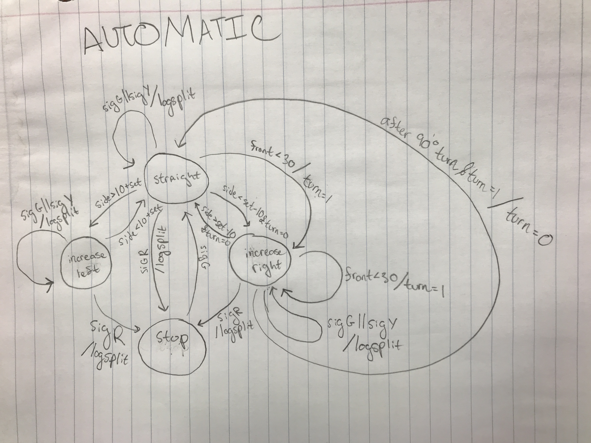
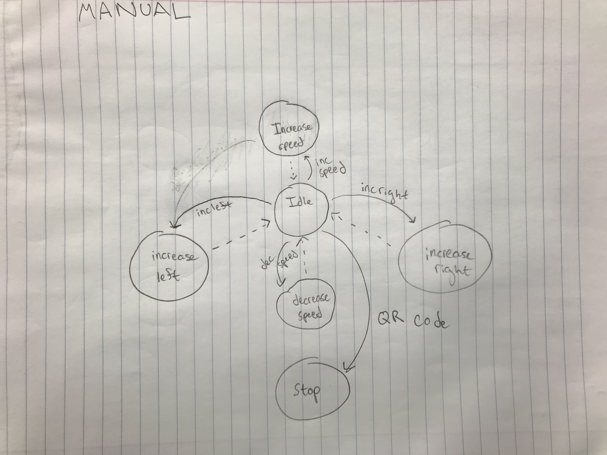

# Quest 6
Authors: Kyle Martin, David Kirk, Ayush Upneja

2019-12-11

## Summary

In this skill, we designed a crawler that navigated a course with 3 turns, 2 of which had to be executed autonomously.  The course also had three stoplight beacons. When the crawler reached these beacons, it would either stop, slow down, or continue moving, depending on whether or not the IR signal was red, yellow, or green. Upon reaching these beacons, the ESP32 on the crawler sent split times to the server and stored them in a TingoDB database. After reaching the third beacon, the crawler switched into manual mode and we drove it to the finish via our web client.  

## Evaluation Criteria

- Functional web steering and speed control L,R,F,R, stop 1
- Web display showing historical splits from database 1
- Web stream from webcam on crawler 1
- All web interfaces in same browser window 1
- Functional range sensors 1
- Functional collision sensor 1
- Functional PID control on variable speed setpoint 0
- Functional IR sensor 1
- Alpha display shows last beacon split time 1
- No collisions in runs 1
- Autonomous: drives straight on long walls without touching 1
- Autonomous: makes turns, L or R turns around obstacles 1
- IR receiver on car receives data from beacon 1
- Car conforms to IR traffic signals (stop and go) 1
- Browser or Rpi decodes and displays value of QR code 0
- System records split time to DB 1
- Able to remote drive vehicle 1
- Completes the course without nudges or touches 10

## Solution Design

### Hardware

The crawler uses the chassis we were given for Quest 4, with several additions. It is controlled with an ESP32, which drives the motor controller directly and the steering motors through and H-bridge. Unlike Quest 4, we have changed our power system so that the ESP32 is now powered off a separate battery, which also powers the Raspberry Pi. We are using two HC-SR04 ultrasonic sensors for rangefinding on the front and left side of the car, and an infrared sensor for picking up the traffic signals. On top, we have a 14-segment display for showing split times. The Raspberry Pi is taped to the top as well, and powers the webcam, which is mounted to the front bumper.

### Firmware

Upon startup, the ESP32 runs a series of startup tasks, including initializing wifi, UDP, UART, I2C, RMT, and a timer. It also runs a motor calibration routine, in order to ensure that the drive motors function correctly. After all of this finishes, it starts up a timer and initializes its parallel tasks.

The firmware executes four types of tasks: one drive control task, one UDP RX task, two RMT RX tasks, and two RMT TX tasks.  For range sensing, we used two HC-SRO4 ultrasonic sensors, one on the front and one on the side. Each of these sensors required an RMT RX and a TX task because they send and recieve signals to determine range.  In order to improve accuracy of the sensors, we pinned the RMT-related tasks to Core 1, since it conflicts with wifi when it runs on Core 0.

The control task first reads the IR reciever to determine if there is a beacon signal present. If the beacon detected is different from the last beacon it saw, the ESP32 stops the timer, sends a message to the server via UDP containing the split time, and resets the timer. If the beacon is transmitting a valid stoplight signal, the motors are set to the appropriate duty:  1270 if green, 1280 if yellow, and 1400 if red.  Then, the front distance and the side distance, which are read and updated every tenth of a second into global variables, are passed to an adjust function, which controls any updates to the turning servo.

The adjust function first checks if the distance from the front wall is between 150 and 160 centimeters.  In this case, the function sets a state boolean to true, which switches the turning state. This state will execute for 20 time cycles, which in our code would be 4 seconds total.  In this state, the angle of the turning servo is set to zero, which is a right turn.  Upon completion of the turn, the state will switch back to the straight line state.

In the straight line state, the side distance is checked. If the distance is greater than 80, the servo will perform a 45 degree left tilt. If the distance is less than 60, the servo will perform a 45 degree right tilt. Otherwise, the angle will remain at 90 degrees.

Upon reception of the signal from the third beacon, the crawler switches to manual mode. While in manual mode, it reacts to signals received over UDP from the Raspberry Pi server. For steering and speed, the integer values sent from the server are in the range of -3 and 3 for steering and unlimited for speed. These signals are multiplied by 30 and -30 for steering and speed, respectively, to be added to a duty of 1400 for speed duty and a value of 90 for the angle. It also can receive a start/stop command as a boolean, with false for stopped and true for running. Unlike the other signals, the crawler will react to a stop command while in automatic mode.


### Backend

We based this code off of the Quest 5 Node.js server, which uses TingoDB to store data. Each time the ESP32 transmits a spit time to the server, it stores it, along with the timestamp when it was received, in the databse. The server also provides an endpoint ```/logs```, which sends the database's contents as a JSON string. Additionally, the server can receive URL parameters (speed, steering, start/stop) for controlling the crawler, which are received from the ```/params``` endpoint as ```speed```, ```steer```, and ```start```. Speed and steering are received as ±1, with the number added onto an internal speed value to control the direction of movement. The start parameter is binary, and toggles the crawler between moving and stopped. All of these instructions are passed on over UDP to the crawler.

### Frontend

There were several components to the frontend. The first component was the steraming. We used the MJPG streaming package, and the javascript example to embed the livestream directly into our database. We tinkered around with the controls, reducing the scaling and optimizing frames per second to try to get it as smooth as possible. The second component was the keyboard input. We used onkeypress and onkeydown too signify to increase/decrease speed and control steering. We also used this for stopping the vehicle. The third component was the recording of split times in the browser. We were able to retrieve the split times from the database and output them in the console log, but were unable to fully display them in the textbox due to JSON errors. That's something that we would be able to fix given a bit more time. We also tried many times to get the QR code reading, using a variety of mechanisms, from reading the PNG directly in the Pi's terminal, to JSQR and QCode Decoder. Nothing was very functional so we had to prioritize our tasks. We are streaming multiple snapshots, so once we figure out how to decode PNGs directly in the browser it should be fairly easy to implement the solution.


## Sketches and Photos
;
;

## Supporting Artifacts
Video Link: https://www.youtube.com/watch?v=rA1G7HUVpqw&feature=youtu.be

## References
- esp-idf/examples/peripherals/rmt_nec_tx_rx/main
- code-examples/ir-car-beacon-capture/
- prior quests and skills


-----

## Reminders

- Video recording in landscape not to exceed 90s
- Each team member appears in video
- Make sure video permission is set accessible to the instructors
- Repo is private
